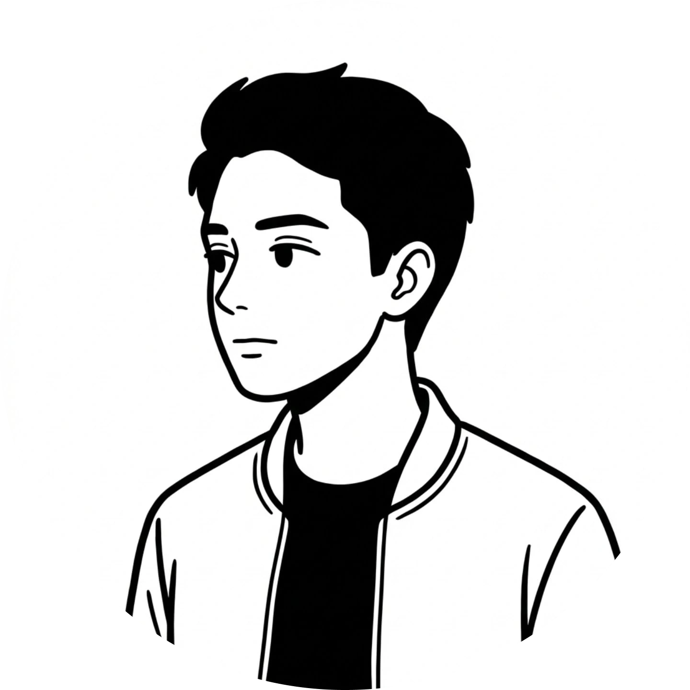

# Atsiila Arya Portfolio

<p align="center">
  
</p>

<p align="center">
  🔥 Personal website built with modern technologies: Next.js, TypeScript, Tailwind CSS, SWR, and Supabase.
</p>

<p align="center">
  <a href="https://github.com/arzss-code/arya-portfolio/stargazers">
    
  </a>
  <a href="https://depfu.com/github/arzss-code/arya-portfolio">
    
  </a>
</p>

---

## 📘 Introduction

This is my personal portfolio and digital garden, built from scratch to showcase my projects, skills, and coding activity. It features a modern, modular architecture and a clean UI focused on performance and user experience.

Feel free to explore the source code, use it as inspiration, or fork it as a template. If you find this project useful, consider giving it a star ⭐.

---

## 🚀 Tech Stack

- **Framework:** [Next.js](https://nextjs.org/) (App Router)
- **Language:** [TypeScript](https://www.typescriptlang.org/)
- **Styling:** [Tailwind CSS](https://tailwindcss.com/)
- **State Management:** [Zustand](https://github.com/pmndrs/zustand)
- **Data Fetching:** [SWR](https://swr.vercel.app/) & [Axios](https://axios-http.com/)
- **Animations:** [Framer Motion](https://www.framer.com/motion/), [GSAP](https://gsap.com/)
- **Database:** [Supabase](https://supabase.com/) (PostgreSQL)
- **Auth:** [NextAuth.js](https://next-auth.js.org/)
- **i18n:** [next-intl](https://next-intl-docs.vercel.app/)

---

## ✨ Features

- **📊 Developer Dashboard:** Visualizes coding activity and traffic using GitHub and Umami Analytics.
- **🗳️ Project Showcase:** Dynamic project listing fetched from Supabase with MDX support for details.
- **🌍 Multi-language:** Full internationalization support (English & Indonesian).
- **🌙 Theme Switching:** Dark and light mode support with `next-themes`.
- **📱 Responsive Design:** Fully optimized for mobile, tablet, and desktop.
- **🚀 Performance:** Optimized images (WebP), server-side rendering, and smooth animations with Lenis.

---

## 🛠 Getting Started

### 1. Clone & Install

```bash
git clone https://github.com/arzss-code/arya-portfolio.git
cd arya-portfolio
bun install
```

> **Note:** [Bun](https://bun.sh/) is the recommended package manager for this project.

### 2. Environment Variables

Create a `.env` file in the root directory and add the following variables:

```env
# NextAuth
NEXTAUTH_URL=http://localhost:3000
NEXTAUTH_SECRET=your_secret

# Supabase
NEXT_PUBLIC_SUPABASE_URL=your_supabase_url
NEXT_PUBLIC_SUPABASE_ANON_KEY=your_supabase_anon_key

# Database (PostgreSQL)
POSTGRES_URL=your_database_url

# GitHub
GITHUB_READ_USER_TOKEN_PERSONAL=your_token
GITHUB_ID=your_client_id
GITHUB_SECRET=your_client_secret

# Umami Analytics
UMAMI_API_KEY=your_key
UMAMI_WEBSITE_ID_SITE=your_id

# Nodemailer
NODEMAILER_EMAIL=your_email
NODEMAILER_PW=your_password
```

### 3. Run Development

```bash
bun run dev
```

Open [http://localhost:3000](http://localhost:3000) to see the result.

---

## 📁 Structure

The project uses a **Modular Feature-First** architecture:
- `app/`: Routing and API handlers.
- `modules/`: Feature-specific components and logic (Home, About, Dashboard).
- `common/`: Shared components, hooks, stores, and utilities.
- `services/`: API abstraction layer.

For more details on the architecture, see [AGENTS.md](./AGENTS.md).

---

## 📄 License

This project is licensed under the **MIT License**.
